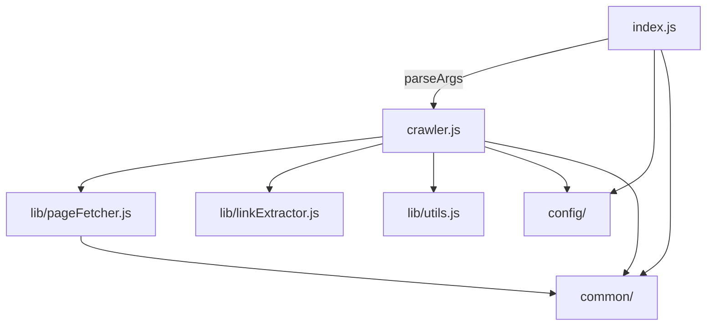

# Zego Web Crawler

Same-hostname web crawler for the Zego coding test. Given a base URL, it visits pages on that **hostname** and prints each page URL with the links found on it.

Plain **Node.js 20+** (CommonJS) — run source directly from `src/` with no compile step.

---

## Setup (for Python engineers)

If you are used to `python -m venv`, `pip install -r requirements.txt`, and `pytest`, the Node equivalents here are:

| Python | This project |
|--------|----------------|
| Python 3.10+ | Node.js 20+ (`node --version`) |
| `pip install -r requirements.txt` | `npm install` (reads `package.json` + lockfile) |
| `python script.py` | `node src/index.js` |
| `python -m package` | `npm start -- …` (runs a script from `package.json`) |
| virtualenv / `.venv` | dependencies live in `node_modules/` (git-ignored; recreated by `npm install`) |
| `pytest` | `npm test` (Mocha + coverage) |
| `argparse` / Click | [Commander](https://github.com/tj/commander.js) |
| `requests` / `httpx` | [got](https://github.com/sindresorhus/got) |
| Beautiful Soup | [Cheerio](https://cheerio.js.org/) |

**1. Install Node.js 20 or later**

Use [nodejs.org](https://nodejs.org/) or a version manager such as [nvm](https://github.com/nvm-sh/nvm) (similar in role to `pyenv`):

```bash
node --version   # should print v20.x or higher
```

**2. Clone and install dependencies**

From the project root:

```bash
npm install
```

This creates `node_modules/` and installs runtime + dev dependencies. You do not need to activate an environment — Node resolves packages from the local `node_modules/` automatically.

**3. Run the crawler**

```bash
npm start -- https://example.com
```

The `--` passes everything after it to the crawler (like `--` with many CLI tools). Options go **after** the URL.

Alternatively, without npm:

```bash
NODE_CONFIG_DIR=./src/config node src/index.js https://example.com
```

`NODE_CONFIG_DIR` tells [node-config](https://github.com/node-config/node-config) where to find `default.json` — similar to pointing Django or pydantic at a settings file.

**4. Run tests**

```bash
npm test
```

Runs unit tests and enforces a 75% coverage threshold (~97% in practice). No network calls in unit tests — HTTP is mocked.

---

## Quick start

```bash
npm install
npm start -- https://example.com
```

Quote URLs that contain `?` or `&` so the shell does not split them (same issue as unquoted `&` in bash/zsh for curl):

```bash
npm start -- "https://example.com/page?utm_source=ads&utm_medium=search"
```

---

## Usage

```bash
npm start -- <base-url> [--concurrency <n>] [--timeout <ms>] [--max-pages <n>]
```

| Option | Default | Notes |
|--------|---------|-------|
| `--concurrency` | 16 | Parallel in-flight requests (async worker pool) |
| `--timeout` | 15000 ms | Per-request timeout |
| `--max-pages` | unlimited | Stop after N pages |
| `-h`, `--help` | | Show usage |

Defaults live in `src/config/default.json`. CLI flags override them at runtime.

**Crawling rules:** same hostname only (exact match, no subdomains); `<a href>` links only; URL fragments stripped; trailing slashes normalised; off-domain redirects rejected; non-HTML pages are not parsed for links.

**Output:** each page on its own line, links indented below.

```
https://example.com/
  https://example.com/about
  https://other-site.com/contact
```

Same-host links are followed. Other domains may appear in output but are **not** crawled.

- **HTTP errors** (404, 5xx, etc.) — skipped on stdout: `Skipped … page not found (HTTP 404)`
- **Timeouts / network / off-domain redirects** — stderr: `Error crawling …` (crawl continues where possible)

---

## Stack

### Runtime and layout

| Piece | Role |
|-------|------|
| **Node.js 20+** | Runtime (LTS recommended) |
| **CommonJS** | `const foo = require('…')` / `module.exports = { … }` — like a flat import style without ES modules |
| **`src/`** | Application source, run directly |
| **`src/config/`** | JSON defaults + accessors (concurrency, timeouts, selectors) |
| **`src/common/`** | Shared enums/constants (HTTP status codes, abort reasons, CLI flags) |
| **`src/lib/`** | HTTP client, HTML parsing helpers, URL utilities |

### Dependencies

| Package | Role | Python analogue |
|---------|------|-----------------|
| [got](https://github.com/sindresorhus/got) | HTTP client — redirects, timeouts, abort signals | `httpx` / `requests` |
| [Cheerio](https://cheerio.js.org/) | Parse HTML and extract `<a href>` links | Beautiful Soup + `lxml` |
| [Commander](https://github.com/tj/commander.js) | CLI parsing, help text, option validation | `argparse` / Click |
| [node-config](https://github.com/node-config/node-config) | Load layered JSON config | YAML/TOML settings module |

### Dev / test

| Package | Role | Python analogue |
|---------|------|-----------------|
| [Mocha](https://mochajs.org/) | Test runner | pytest |
| [Chai](https://www.chaijs.com/) | Assertions (`expect(…).to.equal(…)`) | pytest assertions / `unittest` |
| [Sinon](https://sinonjs.org/) | Stubs/spies (`console`, `process.exit`, `got`) | `unittest.mock` |
| [c8](https://github.com/bcoe/c8) | Coverage reporting (75% threshold in CI) | `coverage.py` / pytest-cov |

CI (`.github/workflows/node.js.yml`) runs `npm test` on Node 20, 22, and 24.

---

## How it works



| Module | Responsibility |
|--------|----------------|
| `index.js` | CLI entry — parses args, validates URL, invokes crawler. Commander’s default stderr is suppressed; this module prints its own error messages. |
| `crawler.js` | BFS crawl engine — queue, concurrency pool, link discovery, console output |
| `lib/pageFetcher.js` | Thin [got](https://github.com/sindresorhus/got) wrapper |
| `lib/linkExtractor.js` | Cheerio link extraction |
| `lib/utils.js` | URL normalisation, same-host checks, content-type checks |
| `common/` | Frozen enum objects for HTTP status, fetch abort/timeout detection, CLI flags |

**Programmatic use** (import the library like a Python package):

```javascript
const { createCrawler } = require('./src/crawler');

await createCrawler('https://example.com', { maxPages: 10 }).run();
```

Optional third argument: inject custom `pageFetcher`, `linkExtractor`, `scopePolicy`, or `pageReporter` (used heavily in tests).

---

## Tests

```bash
npm test              # unit tests + coverage threshold
npm run test:unit     # tests only
npm run coverage      # tests + HTML coverage report in coverage/
```

Tests mirror `src/` layout (`test/common/`, `test/lib/`, etc.). Shared fixtures: `test/fixtures/defaults.json`.

---

## Tools used to build this

The project was developed on **macOS** using the following setup. These are the environment and workflow tools, not the runtime stack (see [Stack](#stack) above).

| Tool | Role |
|------|------|
| **[Cursor](https://cursor.com/)** | Primary IDE — editing, search, integrated terminal, and AI-assisted development |
| **Cursor Agent / Chat** | Used throughout to explore the codebase, implement features, refactor, write tests, and draft documentation; human review and edits applied before commit |
| **[iTerm2](https://iterm2.com/)** | Terminal for running the crawler, tests, git, and npm |
| **[Homebrew](https://brew.sh/)** | macOS package manager — used to install CLI tools (including Node.js or helpers such as [nvm](https://github.com/nvm-sh/nvm)) |
| **Git / [GitHub](https://github.com/)** | Version control, pull requests, and CI via GitHub Actions |

**Typical workflow:** edit in Cursor → run `npm test` in iTerm2 → commit and push to GitHub. AI suggestions were treated as drafts: design choices, simplifications, and final wording along with edits were reviewed manually before landing in the repo.
